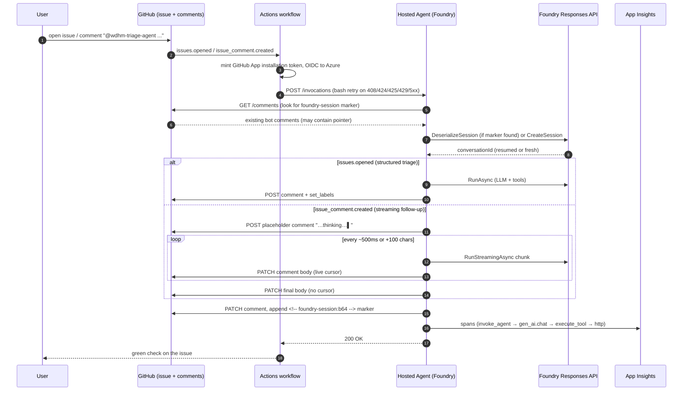

# Hosted Triage Agent

A demo of a GitHub issue triage agent built as a **Microsoft Foundry Hosted
Agent**, with **GitHub Issues as the chat UX**. The point of the demo is to
showcase Foundry Hosted Agents as a stronger hosting option than rolling your
own on Azure App Service or Container Apps.

> **Status**: Wave 3 shipped — end-to-end working, with **streaming follow-up
> replies**, **App Insights tracing**, and **zero container-local state**
> (conversation pointer lives on the issue itself). Open an issue, the agent
> posts a structured triage comment as `wdhm-triage-agent[bot]` with category /
> severity / routing labels. Comment `@wdhm-triage-agent <question>` and the
> reply streams in live, with conversation memory.

## Architecture

```
┌────────────────┐    issue.opened /     ┌──────────────────────┐
│ GitHub Issue   │  issue_comment.created│ GitHub Actions       │
│ + comments     │ ────────────────────► │  triage.yml          │
│ ↑              │                       │  • OIDC to Azure     │
│ (durable state │                       │  • Mint App token    │
│  pointer lives │                       │  • bash-retry curl   │
│  here)         │                       └─────────┬────────────┘
└────────────────┘                                 │ POST /invocations
        ▲                                          ▼
        │                              ┌──────────────────────────┐
        │                              │ .NET 10 Hosted Agent      │
        │                              │ on Microsoft Foundry      │
        │ REST (api.github.com)        │                           │
        │ as wdhm-triage-agent[bot]    │  TriageInvocationHandler  │
        └──────────────────────────────│  ↓                        │
                                       │  ChatClientAgent          │
                                       │  ↓ tools                  │
                                       │  GitHubRestTools          │
                                       │  (add/replace_comment,    │
                                       │   set_issue_labels)       │
                                       └────────────┬─────────────┘
                                                    │
                                       Responses API│ (server-side
                                       holds full   │  conversation
                                       history)    ▼
                                       ┌──────────────────────────┐
                                       │ Foundry Responses API     │
                                       │ keyed by conversationId   │
                                       │ (~24-byte pointer lives   │
                                       │  on the issue comment)    │
                                       └──────────────────────────┘
```

### Per-turn sequence



- **Agent**: `src/triage-agent/` — .NET 10, `Microsoft.Agents.AI.Foundry.Hosting`,
  Invocations protocol.
- **Infra**: `infra/` — Bicep deployed via `azd` (Foundry account + project +
  ACR + App Insights). No App Service plan, no container app, no autoscale
  config, **no Cosmos/Redis/Blob for conversation state**.
- **Trigger**: `.github/workflows/triage.yml` — fires on `issues.opened` and
  `@wdhm-triage-agent`-mentioning `issue_comment.created`, OIDCs into Azure,
  mints a GitHub App installation token, POSTs to the agent (with bash-loop
  retry on cold-start `HTTP 424 session_not_ready`).

## Why Foundry Hosted Agents (vs. App Service / Container Apps)

| Concern | Foundry Hosted Agent | DIY on App Service / Container Apps |
|---|---|---|
| **Provisioning** | `azd up` — Foundry account + project + ACR + App Insights + role assignments wired automatically | You manage plan, slot, autoscale, MI assignment, ACR, App Insights, Key Vault, role assignments yourself |
| **Identity** | Each agent version gets its own platform-assigned managed identity automatically | Manual MI provisioning + RBAC |
| **Versioning** | `azd deploy` = new agent version; old version drains gracefully; `azd ai agent show` lists versions | Slot swaps, blue/green wiring, or roll-your-own |
| **Sessions / memory** | Responses API stores conversation server-side; only a ~24-byte `conversationId` pointer lives anywhere outside Foundry (we keep it on the issue itself — see below) | You wire Redis/Cosmos/SQL, plus a session-ID dance to map "user X turn N" → row |
| **Scale-to-zero** | Default — no idle compute bill | Have to configure autoscale rules; cold-start handling is on you |
| **Cold-start resilience** | Same gateway returns `424 session_not_ready` while a new instance spins; workflow retries with backoff and Foundry handles the rest | Custom warmup pings, request queue, or accept dropped traffic |
| **Local↔cloud parity** | `azd ai agent run` runs the exact same container locally on `http://localhost:8088/invocations` | Docker-compose / Aspire / etc. — separate config |
| **Tool-call observability** | App Insights wired by the platform; per-invocation OTel trace IDs auto-correlated across `invoke_agent → gen_ai.chat → execute_tool → http` | App Insights manual setup |
| **Streaming token-by-token UX** | `RunStreamingAsync` returns an async stream of model deltas; tracing & memory still Just Work | You wire SSE / WebSocket, handle backpressure, and re-correlate spans yourself |

## Conversation memory: zero container-local state

The agent container is **amnesic**. There is no Redis, no Cosmos, no Blob, no
Azure Files mount, and no session-ID dance — yet conversation memory survives
restarts, scale-to-zero, and even a redeploy.

Two stores, one tiny pointer:

| Store | What lives there |
|---|---|
| **Foundry Responses API** | The full conversation history (messages, tool calls, tool results), keyed by `conversationId`. Managed by Foundry. |
| **The GitHub issue itself** | A ~24-byte base64 pointer to the `conversationId`, tucked into a hidden HTML comment on the bot's reply: `<!-- foundry-session:b64 -->`. |

Per turn, the handler:

1. Lists bot comments on the issue (`GET /issues/{n}/comments`).
2. Walks them newest-first, decodes the first valid `foundry-session` marker,
   calls `agent.DeserializeSessionAsync(...)` — re-attaches to the existing
   server-side conversation.
3. Falls back to `CreateSessionAsync` only if no marker decodes.
4. Runs the agent. On success, PATCHes the just-posted comment to append a
   fresh `foundry-session:b64` marker (the new `conversationId`).

Net effect: the issue **is** the durable conversation store as far as our code
is concerned. Cold start a brand-new container? The pointer is right there on
the issue. Side-by-side, the App Service version of this would be a Cosmos
container + a row-level session-id mapper + the inevitable "is the row stale
or is the model still working?" race conditions.

## Highlighted technical details

A few non-obvious things this demo had to solve along the way (each worth a
line in a customer conversation):

1. **GitHub App identity through Foundry's invocation gateway.** The gateway
   strips all non-allowlisted request headers, so the per-request App
   installation token cannot ride on `X-GitHub-Token` — it has to go in the
   JSON body and be pushed onto an `AsyncLocal<string?>` inside the handler,
   so the outbound REST calls pick it up correctly.

2. **Why not the GitHub MCP server for writes.** We tried. The hosted MCP at
   `api.githubcopilot.com/mcp/` rejects the agent's session-id intermittently
   (`400 invalid session` — the HTTP session handshake doesn't survive
   Foundry's process recycling), AND the default endpoint's `context` toolset
   forces the LLM to call `get_me` which hits `GET /user` which returns 403
   for GitHub App installation tokens. We dropped MCP for writes and call
   `api.github.com` directly via lightweight `AIFunction`-wrapped methods —
   bot identity is preserved (the `ghs_` installation token attributes
   comments to `<app>[bot]` automatically).

3. **Idempotency without a local file.** The Wave 2 zero-state model means
   there's no on-disk flag we can flip on success. Instead, idempotency is
   read off the issue: presence of the `<!-- triage-agent-reply -->` marker
   on any bot comment short-circuits a re-fired `issues.opened` event. No
   poisoning failure mode either — we only append the foundry-session marker
   after counters confirm both the comment and the labels actually went out.

4. **Per-issue concurrency.** Workflow concurrency group is
   `triage-${repo_id}-${issue_number}` with `cancel-in-progress: false`, so
   rapid follow-up comments queue instead of racing on the same Foundry
   conversation.

5. **Burst cold-start (`HTTP 424 session_not_ready`).** Foundry returns 424
   while it spins up an instance for a brand-new session, and (sticky) while
   a `session_id` is bound to a container that's been scaled away mid-idle.
   The workflow's `curl` is wrapped in a bash retry loop with exponential
   backoff (`8s → 16s → 32s → 64s`, max 5 attempts). `curl --retry` alone
   doesn't fire here — it treats 4xx as "server replied successfully".
   Retries uniquify the `agent_session_id` (`-r{N}` suffix on comments,
   per-attempt random id on new issues) so a wedged session can't pin every
   retry to the same dead container. Conversation memory is unaffected
   because it lives in Foundry's `ConversationId` (round-tripped via the
   `<!-- foundry-session: ... -->` marker on the bot comment), not in the
   `session_id`. Note: the invocation gateway throttles sustained bursts
   above ~6 sequential calls per warm period with a sticky 5xx that takes
   5–10 minutes to recover, so very large issue bursts should expect the
   tail end to queue at the retry budget's outer edge.

6. **Streaming without losing tracing.** The follow-up path uses
   `RunStreamingAsync` and throttle-PATCHes the comment body every 500ms or
   100 chars. The model gets zero tools (the runtime posts for it), so
   there's no double-post risk. App Insights still sees one
   `invoke_agent` span per request, plus one `gen_ai.chat` span and N
   `replace_comment_body` spans — the trace tree is unchanged.

7. **Zero blocking I/O before `app.Run()`.** A previous revision did a
   credential warm-up and a PAT-connection lookup synchronously between
   `AgentHost.CreateBuilder()` and `app.Run()`. With Kestrel not yet
   listening during those calls, Foundry's `/readiness` probes saw
   connection-refused and the gateway manufactured the very `424
   session_not_ready` responses the warm-up was meant to prevent. Auth is
   now lazy — the first real request triggers the Workload Identity token
   exchange (a file read + Entra POST, typically &lt;200 ms); transient
   failures are absorbed by the workflow's retry loop. There is no longer
   a static PAT path in the agent.

8. **Container logstream on failure.** When the workflow exhausts its
   retry budget, the next step calls Foundry's `:logstream` endpoint for
   the failing `session_id` and uploads the stream as a workflow artifact
   (`foundry-logstream-<run>-<attempt>`). This collapses the failure-mode
   investigation loop from "spelunk App Insights for spans that may never
   have been emitted" to "open the artifact, read the container stdout".

## App Insights tracing

Every invocation emits a single OTel trace tree:

```
invoke_agent (Microsoft.Agents.AI)
└── gen_ai.chat gpt-5-mini (Microsoft.Extensions.AI)
    ├── execute_tool add_issue_comment       (Microsoft.Extensions.AI)
    │   └── add_issue_comment                (TriageAgent.Tools)
    │       └── HTTP POST api.github.com     (auto-instrumented)
    ├── execute_tool set_issue_labels        (...)
    └── ...
```

The bot's reply comment ends with the trace ID in a footer:

> 🔎 **Foundry trace**: `<32-hex-id>` — open App Insights Logs and run
> `union requests, dependencies, traces, exceptions | where operation_Id == "<id>"`

…so anyone reading the issue can paste that into App Insights and see the
full span tree, model name, prompt/completion tokens, and per-tool latency.
`EnableSensitiveData` is off, so raw prompts/completions are not exported.

## Quickstart (from scratch)

Prereqs: `azd` ≥ 1.25, `dotnet` ≥ 10, `az`, `gh`, an Azure subscription, a
GitHub repo.

```bash
azd auth login
az login

# Provision Foundry account, project, ACR, App Insights (≈ 4 min)
azd provision

# Build container, push to ACR, register agent version (≈ 3 min)
azd deploy
```

### GitHub side

1. Create a GitHub App owned by the repo's account with:
   - Repository permissions: **Issues: Read & write**, **Metadata: Read**
   - Install it on the repo
2. Add these repo secrets:
   - `TRIAGE_AGENT_APP_ID` — the App ID
   - `TRIAGE_AGENT_APP_PRIVATE_KEY` — the App's private key (PEM)
   - `AZURE_CLIENT_ID`, `AZURE_TENANT_ID`, `AZURE_SUBSCRIPTION_ID` — the
     OIDC service principal that can invoke the Foundry agent
3. Add this repo variable:
   - `FOUNDRY_INVOCATIONS_URL` — the agent endpoint output by `azd deploy`
4. Open an issue. Within ~25 s the bot posts the triage comment.

## Triggers

| Event | Workflow filter | What the agent does |
|---|---|---|
| Issue opened | always | Full triage: categorize, severity, label, post comment (non-streamed — the structured table looks better as a single block) |
| Issue comment containing `@wdhm-triage-agent` | (and not from a `[bot]`, not containing the hidden reply marker) | Follow-up reply, **streamed** into a placeholder comment with a typing cursor |

> Note: GitHub does NOT autocomplete `[bot]` identities in the @-mention picker
> — type `@wdhm-triage-agent` literally. The workflow's `contains()` filter
> matches the text regardless of whether GitHub renders it as a hyperlink.

## Layout

```
.
├── .github/workflows/triage.yml      # Trigger + invocation (with bash retry loop)
├── azure.yaml                         # azd config
├── infra/                             # Bicep (Foundry, ACR, App Insights)
└── src/triage-agent/
    ├── Program.cs                     # Startup, DI, agent + tool wiring, OTel sources
    ├── TriageInvocationHandler.cs     # Per-invocation routing, system prompts, streaming
    ├── GitHubRestTools.cs             # REST tools + session-marker helpers
    ├── GitHubTokenProvider.cs         # Per-request AsyncLocal App-installation token
    ├── agent.yaml                     # Hosted agent manifest
    └── triage-agent.csproj
```

